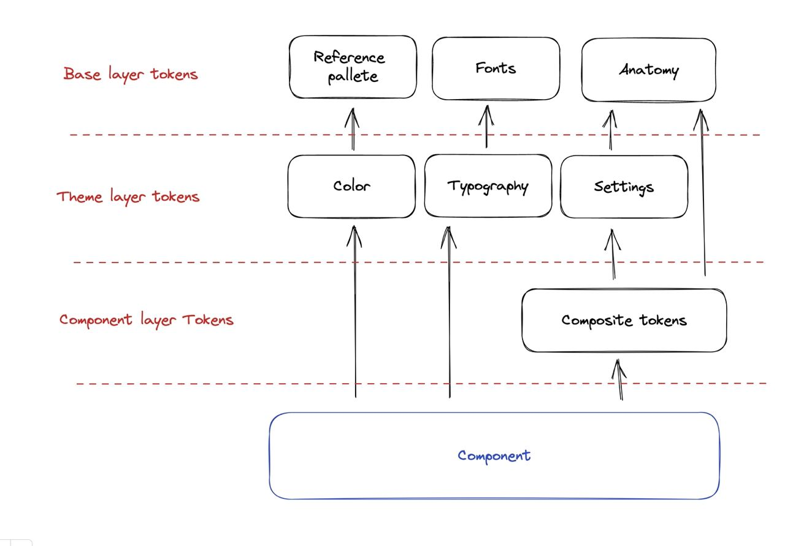

# Figma tokens

Пакет figma-токенов дизайн-системы компании [Cloud.ru](https://cloud.ru/) и сообщества [TeamSnack](https://t.me/+tN0DDzHaDVc3M2Iy)

- [Макеты Figma](<https://www.figma.com/files/1101513230643708615/team/1194627249980298820/DS-(FF)>)
- Инструмент для пресборки токенов: [Token Transformer](https://github.com/tokens-studio/figma-plugin/tree/main/token-transformer)
- Инструмент для сборки json-токенов в соответствующие стилевые файлы: [Style Dictionary](https://amzn.github.io/style-dictionary/)

## Начало работы

1. Установите зависимости: `npm install`
2. Запустите сборку: `npm run build:all`

В репозитории собираются:

- CSS-файл со значениями токенов (содержит два класса для модификаций - .light и .dark):
  `build/css/brand.module.css`
- SCSS-файлы с токенами: `build/scss`
- TS-файлы с токенами: `build/ts`

## Работа с токенами

### Семантика токенов

Есть 3 слоя токенов - базовые, тематические и компонентные (лежат в папках Base, Theme и Components соответственно)

- Базовые - самые основные токены; внутри поделены на токены цветов, шрифтов и анатомии
- Тематические токены - ссылаются на базовые токены; существуют в двух модификациях для цветов - Light и Dark
- Токены компонентов - ссылаются на тематические токены (либо напрямую на базовые, если не требуется темизация каких-либо св-в); поделены покомпонентно



### Типы токенов

- Обычные - токены содержат одно св-во и применяются к конкретному св-ву css с помощью функции `simple-var` либо напрямую через css-var, если это простая переменная

```scss
.buttonLabel {
  color: simple-var($theme-variables, 'sys', 'primary', 'on-accent');
  // или
  color: $sys-primary-on-accent;
}
```

- Композитные (composite, typography, border) - токен внутри содержит несколько св-в css - их нужно применять внутри класса с помощью миксина `composite-var`

```scss
.buttonLabel {
  @include composite-var($theme-variables, 'sans', 'label', 'size-s');
  // или
  @include composite-var($sans-label-size-s);
}
```

- Случаи-исключения:
  - Токен для св-ва outline - в figma для него нет специального типа, поэтому для него используется композитный токен типа border. Соответственно, для него понадобится свой миксин `outline-var`

```scss
.button {
  &:focus-visible {
    @include outline-var($container-focused-available-size-s);
  }
}
```

## Связи слоёв токенов


1.  **Base/Colors (References palette)**
    Базовые переменные для формирования System palette
    Это наборы тонов для каждого цвета, где каждый тон имеет порядковый номер. Каждый цвет разложен на 20 тонов от самого тёмного до самого светлого.
    Для единого представления каждым человеком о цвете, они именуются простейшими цветами радуги.
    Любые изменения переменных отразятся на System palette

2.  **Themes/Color (System palette)**
    Набор семантических стилей, применяется на Components или его элементах напрямую как в figma, так и коде. Эти стили не используются в Composition токенах. Включение цвета в Composition токены приведет к порождению большого количества однообразных токенов в которых меняется только цвет, так как при изменении состояния компонента необходимо менять цвет, следовательно возникнет потребность в создании еше одного Composition токена.
    System палитра, в отличии от References, обладает меньшим количеством цветов.
    System палитра имеет 2 модификации - темная и светлая. Эти модификации наследуют разные тона References палитры, наследие тонов заведомо распределено и переопределяется при переключении модификации.
    Любые изменения переменных отразятся на Components.

3.  **Base/Fonts**
    Набор базовых переменных для построения стилей типографики - семейство шрифтов, вес шрифта, высота строки, размер шрифта, интервал между буквами, интервал между абзацами, декоратор текста
    Любые изменения переменных отразятся на Typography

4.  **Themes/Typography**
    Набор семантических стилей типографики, применяются к компоненту напрямую в фигма и коде.Семантика стилей разделена на 5 ролей, для каждой роли задаётся по 3 размера.
    Typography имеет 2 модификации - темная и светлая, возможно переопределение стилей с модификацией.
    Цвет типографики устанавливается в компоненте из Themes/Color
    Любые изменения переменных отразятся на Components

5.  **Themes/Effects**
    Переменные для эффектов - тени или размытия
    Набор семантических стилей, применяется на Components или его элементах напрямую как в фигма, так и коде.
    Effects имеет 2 модификации - темная и светлая. Эти модификации могут быть с разными настройками эффектов.
    Любые изменения переменных отразятся на Components

6.  **Base/Anatomy**
    Базовые переменные для формирования анатомических свойства компонентов - размеров, отступов, бордеров, скруглений и непрозрачности.
    Любые изменения переменных отразятся на Settings

7.  **Themes/Settings**
    Переменные, семантически связанные с анатомическими свойствами Components.
    Это переменные для настройки анатомических свойств компонентов темы. Переменные используются в Composition tokens, это позволяет вносить изменения в анатомию компонента без изменения токена применённого на самом компоненте. Переменные могут иметь математические вычисления, что не допустимо на слое Components.
    Переменные сгруппированы по анатомическим свойствам.
    Любые изменения переменных отразятся на Composition token.

        * 7.1 **Themes/Settings**
          Переменные, семантически связанные с анатомическими свойствами Components.
          Возможно прямое применение на компоненте как в фигма, так и коде в случаях когда Composition token создает ограничение в реализации компонента в коде. Например, оффсет дроплиста может применяться с одной из 4 его сторон, в зависимости от того, где расположен его триггер. В таком случае не получится задать этот оффсет в каком-то конкретном направлении (а значит, не стоит использовать Composition token).
          В этом случае не допустимы математические вычисления в токене.
          Любые изменения переменных отразятся на Components или элементе Components.

8.  **Components/Composition tokens**
    Переменные, семантически связанные с Components или набором элементов Components.
    Эти переменные объединяют в себе несколько параметров анатомии компонента, значения переменных зависят от Settings
    Применяется на Components или его элементах напрямую как в фигма, так и коде.
    Не допустимы математические вычисления в значениях переменных.
    Любые изменения переменных отразятся на Components.

### Как использовать токены в приложении

1. Подключите пакет `@snack-uikit/figma-tokens` актуальной версии
2. Подключите файл с токенами, а затем поместите их в нужное место, используя вспомогательные функции `var`, `simple-var` или `composite-var`

- scss

```scss
@import '@snack-uikit/figma-tokens/build/scss/styles-theme-variables';

.wrapper {
  color: $sys-primary-text-main-enabled;
  opacity: simple-var($theme-variables, 'opacity', 'a032');

  @include composite-var($sans-label-l);
}
```

- ts

```typescript
import { styled } from '@linaria/react';
import { themeVars } from '@snack-uikit/figma-tokens';

export const Wrapper = styled.div`
  color: ${themeVars.sys.primary.textMainEnabled};

  ${themeVars.sans.label.s};
`;
```

### Как использовать токены в компонентах uikit-a

1. Проверьте, что в uikit подключен пакет `@snack-uikit/figma-tokens` актуальной версии
2. Создайте файл для компонента (напр., `ButtonFilled.tsx`) и scss-файл для стилей (`styles.module.scss`), который импортируется в файл компонента
3. Подключите файлы с токенами в `styles.module.scss` (тематические, компонентные - какие нужны):
   - файлы с токенами компонентов по умолчанию уже включают в себя тематические токены

```scss
@import '@snack-uikit/figma-tokens/build/scss/styles-theme-variables';
@import '@snack-uikit/figma-tokens/build/scss/components/styles-tokens-***';
```

4. Соберите стили компонента по макетам в figma, подключая токены через `var`, `simple-var` или `composite-var`
   - в scss можно также добавлять миксины и различные функции, чтобы убирать дублирование кода, пример:

```scss
// пример миксина, в других случаях код может быть другой

$sizes: s, m, l;
$variants: label-only, icon-only, label-icon;

@mixin button-anatomy-styles {
  @each $size in $sizes {
    &[data-size='#{$size}'] {
      @each $variant in $variants {
        &[data-variant='#{$variant}'] {
          @include composite-var($button-filled, 'container', $size, $variant);
        }
      }
    }
  }
}

.button {
  @include button-anatomy-styles;
}
```

5. Подключите scss-файл в компонент в виде объекта с класснеймами, и далее используйте следующим образом:

```tsx
import styles from './styles.module.scss';

export type ButtonFilledProps = {
  label?: string;
  size?: Size;
  variant?: Variant;
  disabled?: boolean;
  loading?: boolean;
};

export const ButtonFilled = ({ label, size, variant, disabled, loading }: ButtonFilledProps) => {
  return (
    <button
      className={classNames.button}
      data-size={size}
      data-variant={variant}
      data-disabled={disabled || undefined}
      data-loading={loading || undefined}
    >
      <label className={styles.label}>{label}</label>
    </button>
  );
};
```

## Процесс сборки пакета с токенами

1. Сборка json-ов c помощью **token-transformer** (в подходящий формат для **style-dictionary**) (`scripts/buildTokens`)

   - Сборка базовых и тематических токенов (папка `build/tokens/themes`)
     - Согласно файлу `tokens/$themes.json` происходит сборка тематических файлов (в файле лежит 2 конфига для тем, с указанием, какие наборы токенов надо включить - св-во `selectedTokenSets`)
     - **token-transformer** собирает базовые токены и токены темы в 2 общих файла - для модификаций dark и light
     - Сборка **token-transformer**-ом включает в себя резолв всех зависимостей и арифметических операций
   - Сборка токенов компонентов (папка `build/tokens/components`)
     - Для каждого компонента собирается отдельный файл с токенами
     - Связи с токенами тем и базовыми здесь уже не резолвятся, т.к. они нужны для работы тем в дальнейшем
     - Важно - в токенах компонентов должны отсутствовать арифметические операции! Должны быть только ссылки на базовые/тематические токены

2. Сборка css, scss и ts файлов из json-ов с помощью **style-dictionary** (`scripts/buildStyleFiles`)
   - Сборка тематических файлов
     - Файл с темами (`build/css/brand.module.css`)
     - Файлы, содержащий только токены темы:
       - SCSS (`build/scss/styles-theme-variables.scss`)
       - TS (`build/ts/styles-theme-variables.ts`)
     - Файл с темами подключается в проекте в корневую директорию, где нужно навесить классы на самую верхнюю обёртку
     - Файлы только с токенами подключаются в конкретном месте использования токенов
   - Сборка компонентных файлов (папка `build/scss/components`)
     - Для каждого компонента собирается свой scss, который содержит компонентные токены - они подключаются в конкретный компонент
   - Основные понятия для работы со **style-dictionary**
     - **Transform** - трансформеры для токенов - функция, которая принимает сырой токен и может его преобразовать в какой-либо формат
       - `scripts/buildStyleFiles/transformers`
       - См. https://amzn.github.io/style-dictionary/#/transforms
     - **Filter** - фильтр для токенов - функция, которая принимает токен и возвращает true/false - брать или не брать токен в итоговый список токенов
       - `scripts/buildStyleFiles/tokenFilters.ts`
       - См. https://amzn.github.io/style-dictionary/#/formats?id=filtering-tokens
     - **Format** - форматы для файлов - функция, которая принимает в себя итоговый список токенов и возвращает контент файла (т.е. на текущий момент - это контент scss файла)
       - `scripts/buildStyleFiles/fileFormatters`
       - См. https://amzn.github.io/style-dictionary/#/formats
     - Конфиги для **style-dictionary**
       - `scripts/buildStyleFiles/utils/getCSSModuleThemeConfig.ts` - конфиг для сборки тематического css-файла
       - `scripts/buildStyleFiles/utils/getSCSSThemeVariablesConfig.ts` - конфиг для сборки scss-файла с токенами
       - `scripts/buildStyleFiles/utils/getTSThemeVariablesConfig.ts` - конфиг для сборки ts-файла с токенами
       - `scripts/buildStyleFiles/utils/getComponentStylesConfig.ts` - конфиг для сборки компонентных scss файлов

## Создание собственной темы

Видео инструкция представлена по [ссылке](https://youtu.be/5XBO013F3NI)

### Настройка форка figma-tokens

1. Переходим на репозиторий с [токенами](https://github.com/cloud-ru-tech/figma-tokens) и создаем форк
2. Добавляем в Repository secrets переменную `CI_NPM_TOKEN` с Access токеном из npmjs (для публикации собственного пакета)
3. Создаем ветку `brand` и переносим в корень содержимое папки `github-settings-example`
4. Подставляем собственные значения (`YOUR_PACKAGE_NAME`, `YOUR_BRAND`, `YOUR USERNAME`, `YOUR_USERNAME`) в `patch.package.json`
5. Пушим измения в `origin/brand`
6. Меняем `default branch` в настройках репозитория на `brand`

### Рекомендации\*

1. Ветка `brand` является корневой для хранения настроек для собственного бренда
2. Новые коммиты в `brand` добавляются только через `Pull Request`
3. Запретить пуши в ветку `master` и держать эту ветку синхронизированной с оригиналом
4. Для автоматической синхронизации форка и ребейза ветки `brand` использовать воркфлоу `Auto fork sync`
5. Для выпуска превью версии пакета использовать воркфлоу `Release Preview`

<!-- TODO: добавить доки по хьютону -->
